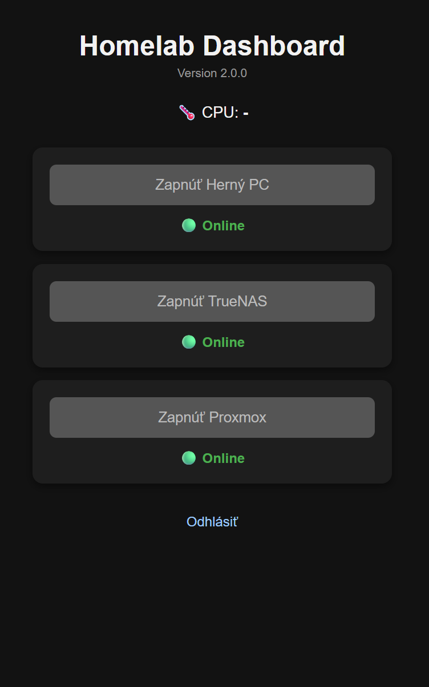

# Homelab Dashboard

A lightweight Flask dashboard for Raspberry Pi and other Linux systems.

Originally created as a simple Wake-on-LAN utility, the project has evolved into a modular dashboard for monitoring and managing homelab devices.

> **Current version:** 2.0.0

---

## Features

- Wake-on-LAN for multiple devices
- Live online/offline status monitoring
- CPU temperature monitoring
- NUT UPS integration
- Modern dark user interface
- AJAX-based dashboard (no page reloads)
- Simple authentication
- Modular service architecture
- Lightweight Flask backend
- Optimized for Raspberry Pi

---

## Screenshot



---

## Requirements

- Raspberry Pi OS (recommended)
- Python 3.10 or newer
- Flask
- wakeonlan
- Network UPS Tools (NUT) client *(optional)*

All Python dependencies are listed in `requirements.txt`.

---

## Installation

Clone the repository:

```bash
git clone https://github.com/<YOUR_USERNAME>/rpi-wol.git
cd rpi-wol
```

Create a virtual environment:

```bash
python3 -m venv .venv
```

Activate it:

Linux

```bash
source .venv/bin/activate
```

Windows

```powershell
.venv\Scripts\activate
```

Install dependencies:

```bash
pip install -r requirements.txt
```

---

## Configuration

Copy the example configuration:

```bash
cp config.example.json config.json
```

or on Windows:

```powershell
copy config.example.json config.json
```

Edit `config.json` and configure:

- application title
- secret key
- login credentials
- Wake-on-LAN broadcast address
- monitored devices
- UPS connection (optional)

---

## Running

Start the application:

```bash
python app.py
```

By default the dashboard is available at:

```
http://<raspberrypi-ip>:5000
```

---

## Updating

Pull the latest version:

```bash
git pull
```

Install updated dependencies if required:

```bash
pip install -r requirements.txt
```

Restart the application or systemd service.

---

## Project Structure

```
api/
services/
static/
    css/
    js/
templates/

app.py
config.py
config.example.json
requirements.txt
```

---

## Roadmap

Planned features for future releases:

- Docker support
- Multiple UPS support
- Network statistics
- Historical graphs
- Service monitoring
- Plugin architecture
- Mobile UI improvements
- Dashboard widgets
- Theme customization

---

## License

This project is licensed under the MIT License.

See the LICENSE file for details.